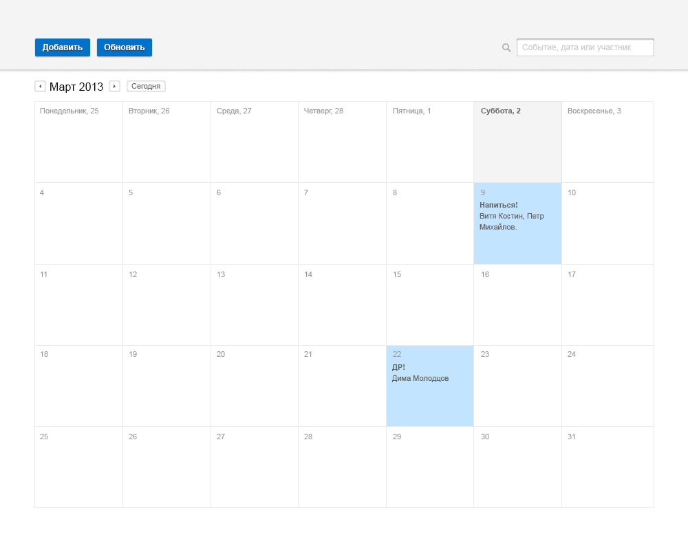

Тестовое задание на front-end developer.

Сверстать адаптивную страницу по макету. На планшетах и сматрфонах таблица должна выводиться в одну колонку.
На устройствах с бОльшим экраном - размещаться посредине с максимальной шириной 1024px.

В некоторых ячейках дней необходимо вывести рейтинг в виде количества звезд по макету ниже

Рейтинг выводится под всем текстом в ячейке с отбивкой вправо.

Данные рейтинга получать и выводить после загрузки страницы через ajax POST-запросом по адресу:

http://promo.fabiohome.ru/test
 
Диапазон дат для получения рейтинга задается двумя параметрами POST-запроса: 
"begin"
"end"
Формат даты "Y/m/d", например "2017/09/13"

Результат выложить на pages.github.com